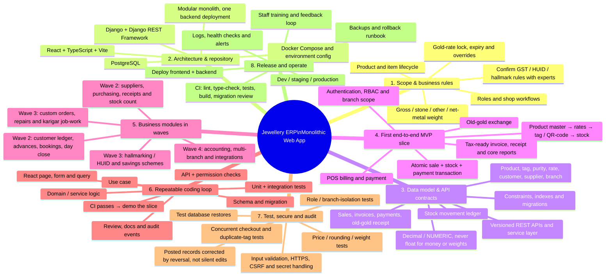

# Jewellery ERP — Coding Workflow Mindmap

```mermaid
mindmap
  root((Jewellery ERP\nMonolithic Web App))
    1. Scope & business rules
      Roles and shop workflows
      Product and item lifecycle
      Gross / stone / other / net-metal weight
      Gold-rate lock, expiry and overrides
      Confirm GST / HUID / hallmark rules with experts
    2. Architecture & repository
      React + TypeScript + Vite
      Django + Django REST Framework
      PostgreSQL
      Modular monolith, one backend deployment
      Docker Compose and environment config
    3. Data model & API contracts
      Product, tag, purity, rate, customer, supplier, branch
      Stock movement ledger
      Sales, invoices, payments, old-gold receipt
      Decimal / NUMERIC, never float for money or weights
      Constraints, indexes and migrations
      Versioned REST APIs and service layer
    4. First end-to-end MVP slice
      Authentication, RBAC and branch scope
      Product master → rates → tag / QR-code → stock
      POS billing and payment
      Old-gold exchange
      Tax-ready invoice, receipt and core reports
      Atomic sale + stock + payment transaction
    5. Business modules in waves
      Wave 2: suppliers, purchasing, receipts and stock count
      Wave 2: customer ledger, advances, bookings, day close
      Wave 3: custom orders, repairs and karigar job-work
      Wave 3: hallmarking / HUID and savings schemes
      Wave 4: accounting, multi-branch and integrations
    6. Repeatable coding loop
      Use case
      Schema and migration
      Domain / service logic
      API + permission checks
      React page, form and query
      Unit + integration tests
      Review, docs and audit events
      CI passes → demo the slice
    7. Test, secure and audit
      Price / rounding / weight tests
      Concurrent checkout and duplicate-tag tests
      Role / branch-isolation tests
      Input validation, HTTPS, CSRF and secret handling
      Posted records corrected by reversal, not silent edits
      Test database restores
    8. Release and operate
      Dev / staging / production
      CI: lint, type-check, tests, build, migration review
      Deploy frontend + backend
      Logs, health checks and alerts
      Backups and rollback runbook
      Staff training and feedback loop
```
